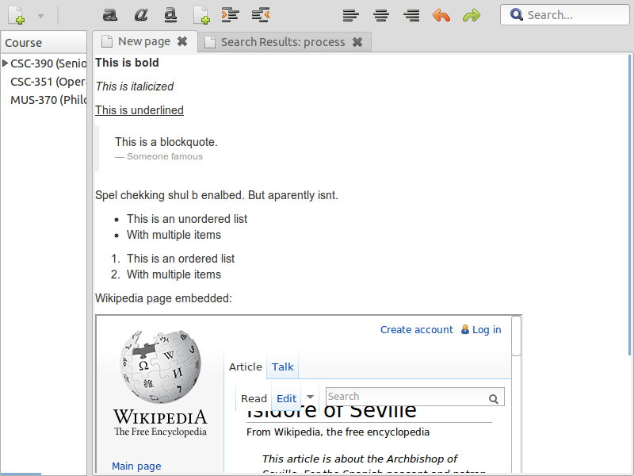
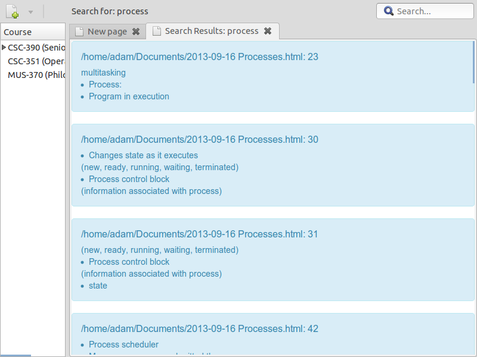

Project Statement
=================

Many students use portable computers to take notes in a modern university
setting. However, there are very few tools specifically designed with this
task in mind; word processors, for example, devote too much attention to 
formatting and layout - important features for printed documents, but hardly 
suited to recording a collection of related ideas such as a lecture. Why 
force users to think in terms of pages and documents, when what they really
want are segments of information?

For my senior project, I will create an application that allows students to
take and organize notes, gather information related to classes, manage their
schedules, and other related functionality. Notes will be automatically
tagged and sorted by date, grouped by course, and can be hyperlinked together.
Text-based notes, web sources, and diagrams will be supported. As an 
additional feature, the appliction should allow for reminders to be added for
upcoming assignments/tests.

Acceptance Tests
================

The user should be able to:
- Add a new course (collection of notes) [WORKING!]
- Create a new text note [WORKING!]
- Create a new drawing
- Embed a drawing in a text note
- Embed a web page in a text note [WORKING!]
- Link to a web page from a text note
- Link to a note from another note
- View and edit previous notes [WORKING!]
- Save a list of upcoming assignments for each course
- Search their notes [PROOF-OF-CONCEPT]

The software should:
- Automatically mark a note with the date and time it was created [WORKING]
- Display a reminder of upcoming assignments

Design Norms
============

Cultural Appropriateness
------------------------
- The program should make it easier for students to take notes in class, enhancing their education

Openness and Communication
--------------------------
- The program will be open source, allowing it to be understood by anyone with the desire to learn
- The program will allow a student to get information from a lecturer and store it in such a way that it will be easily accesible and logically structured

Stewardship
-----------
- Extensibility: The program will allow new types of note to be added as plugins, allowing it to support future education scenarios
- Economic: The program will provide a free alternative to commercial software such as Microsoft OneNote

Aesthetic
---------
- The software should be visually appealing and present information clearly and simply

Trust
-----
- The software should store notes in a format that will be accessible without needed to use the software, so that notes will not be locked in to the platform
- The software WILL NOT replace proper studying techniques, merely enhance the student's work

References
==========

- HTML Pocket Reference, David Flanagan (O'Reilly Media)
- Javascript Pocket Reference, Jennifer Niederst Robbins (O'Reilly Media)
- GTK documentation (http://www.gtk.org/documentation.php)

Required Tools
==============

Development
-----------
- Eclipse with PyDev
- Git
- Python
- Gtk 3.0
- Sqlite

Deployment
----------
- Linux/Windows
- Python

User Stories
============

As a student, I want to:
- input my course schedule into the application
- view my courses in a sidebar and in a calendar
- make reminders for upcoming assignments/tests
- create a new page of notes
- edit an existing page of notes
- link one page of notes to a previous page
- add a web source (reference, Discovery, etc) and reference it from a note
- draw a diagram and insert it into a note
- install the application on an Ubuntu system (and potentially a Windows/Mac system)
- search my notes

Sqlite Database Schema
===============

Table 'course':
  - code TEXT
  - title TEXT

Table 'note':
  - date TEXT
  - course FOREIGN KEY (course)
  - path TEXT

Screenshots
===========

Roadmap
=======

- Minor visual improvements: Interface is missing icons, proportions are not optimal, visual cues are missing
- Finish implementing search feature
- Provide 'diagram' note type
- Build executable files
- Allow linking/embedding between notes
- Display courses in calendar view
